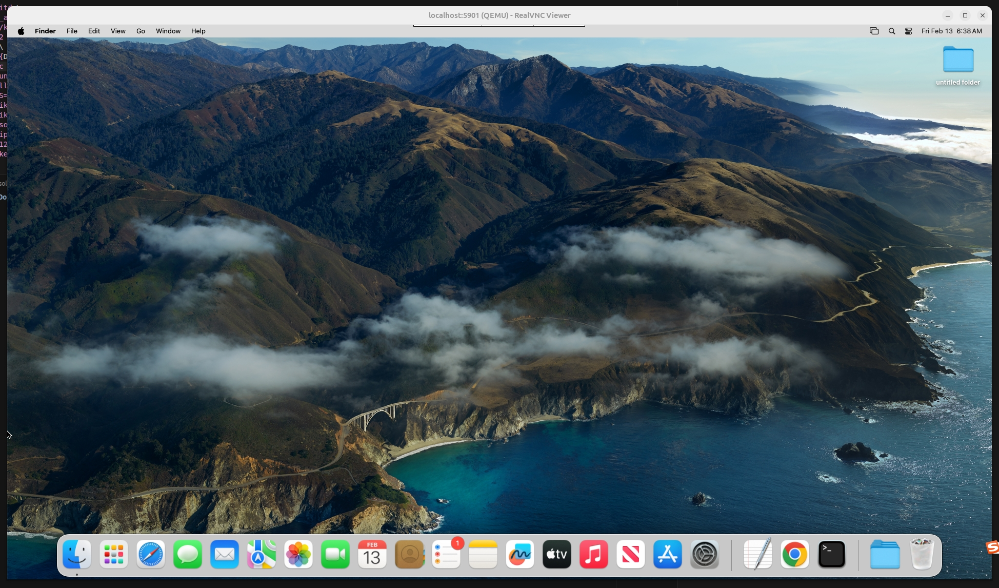
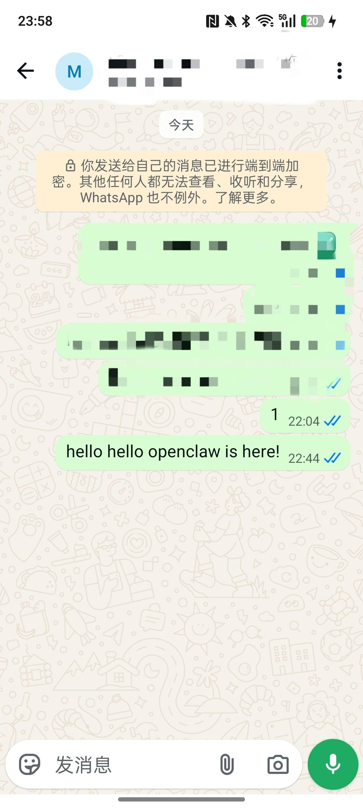
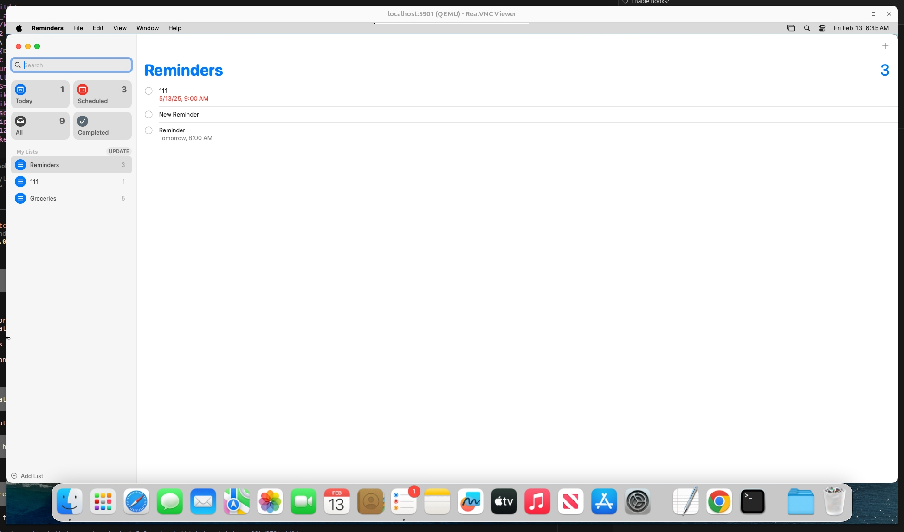

# Mac-in-Docker-OpenClaw

> **No Mac? No Problem!**
>
> 想体验 OpenClaw 的完整功能，却苦于没有 Mac？本项目让你在 Windows / Linux 上通过 Docker 运行 macOS，零成本解锁 OpenClaw 全部能力。
>
> 已有 Mac 但担心安全问题？用 Docker 隔离运行，安心尝鲜。

## 目录

- [前置条件](#前置条件)
- [下载 macOS 镜像](#下载-macos-镜像)
- [启动 macOS Docker 容器](#启动-macos-docker-容器)
- [配置 OpenClaw](#配置-openclaw)
- [启动 OpenClaw](#启动-openclaw)
- [功能演示](#功能演示)

---

## 前置条件

- Docker 已安装
- Linux 或 Windows(WSL)

---

## 下载 macOS 镜像

从 Hugging Face 下载所需的镜像文件（约 50GB）：

```bash
pip install huggingface_hub

huggingface-cli download fuyikun/Mac-in-docker-OpenClaw --local-dir .
```

或使用 Python：

```python
from huggingface_hub import snapshot_download

snapshot_download(repo_id="fuyikun/Mac-in-docker-OpenClaw", local_dir=".")
```

---

## 启动 macOS Docker 容器

```bash
# 启动容器
./start_mac.sh

# SSH 连接到 macOS
ssh -p 52271 pipiwu@localhost

# VNC 连接到 macOS 桌面
vncviewer localhost:5901

```



> **注意**：首次连接可能需要等待容器完全启动。

---

## 配置 OpenClaw

```bash
openclaw onboard --install-daemon
```

按照向导完成以下配置：

### 1. 安全警告确认

选择 **Yes** 继续。

### 2. 选择 Onboarding 模式

选择 **QuickStart**。

### 3. 配置 AI 模型

1. Model/auth provider: **OpenAI**
2. OpenAI auth method: **OpenAI Codex (ChatGPT OAuth)**
3. 在本地浏览器打开生成的 OAuth URL
4. 登录后复制重定向 URL 粘贴回终端

### 4. 配置 WhatsApp

1. Select channel: **WhatsApp (QR link)**
2. Link WhatsApp now (QR)?: **Yes**
3. 用手机 WhatsApp 扫描终端中的 QR 码
   - WhatsApp → 设置 → 已关联设备 → 关联设备
4. 输入你的 WhatsApp 手机号码（如 `+8618698002296`）

### 5. 配置技能和服务

- Configure skills now?: **Yes**
- Install missing skill dependencies: **Skip for now**
- API Keys: 按需配置

### 6. 配置 Hooks 和 Gateway

- Enable hooks?: **Skip for now**
- Gateway service: **Restart**

---

## 启动 OpenClaw

选择 **Hatch in TUI (recommended)** 启动终端交互界面。

---

## 功能演示

### 发送 WhatsApp 消息

```
send a message to my whatsapp
```



### 设置提醒事项

```
Use Reminders to set a reminder for 8:00 AM tomorrow morning.
```



支持的提醒格式示例：

| 示例指令 | 说明 |
|----------|------|
| `Remind me to call mom at 3pm` | 下午3点提醒打电话 |
| `Set a reminder for tomorrow 9am to check emails` | 明天早9点检查邮件 |
| `Create a reminder: meeting in 2 hours` | 2小时后会议提醒 |

---

## Acknowledgements

感谢 [sickcodes/Docker-OSX](https://github.com/sickcodes/Docker-OSX) 和 [OpenGVLab/ScaleCUA](https://github.com/OpenGVLab/ScaleCUA)。

---

*文档更新时间: 2026-02-13*
