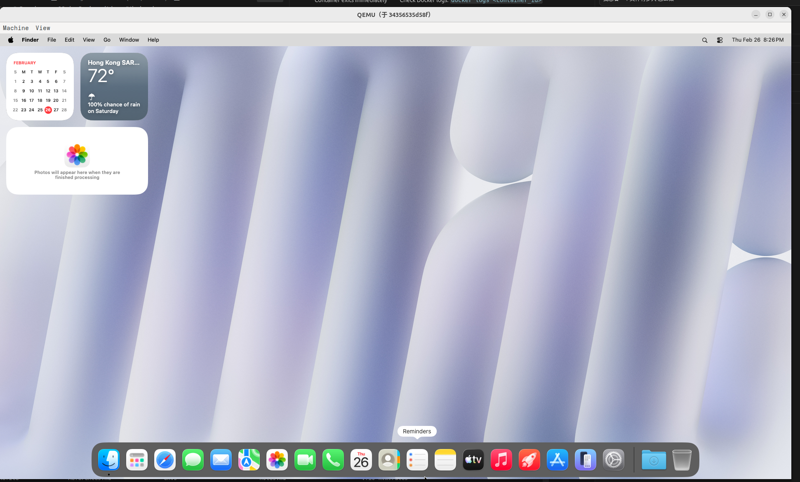
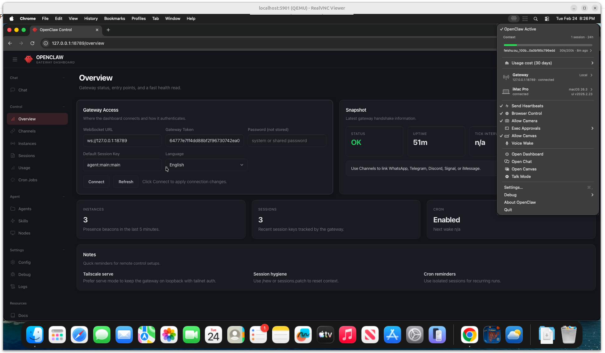
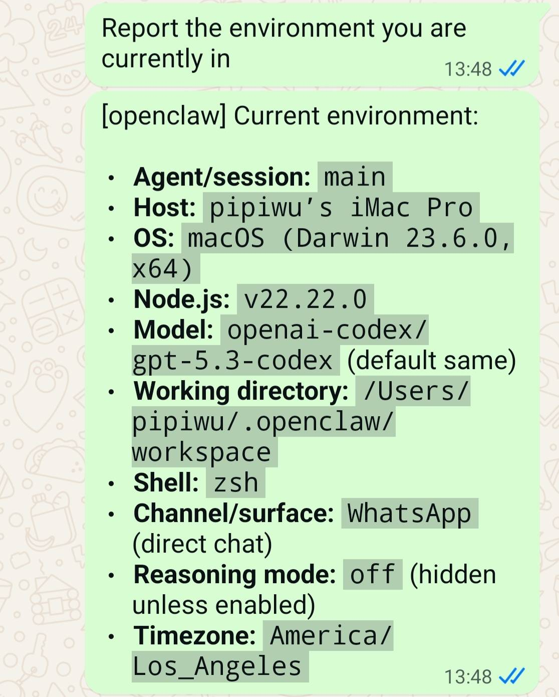
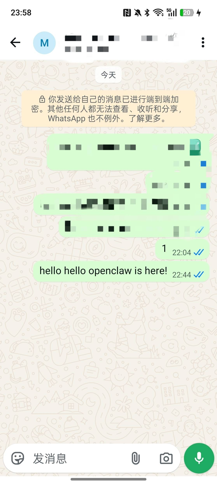
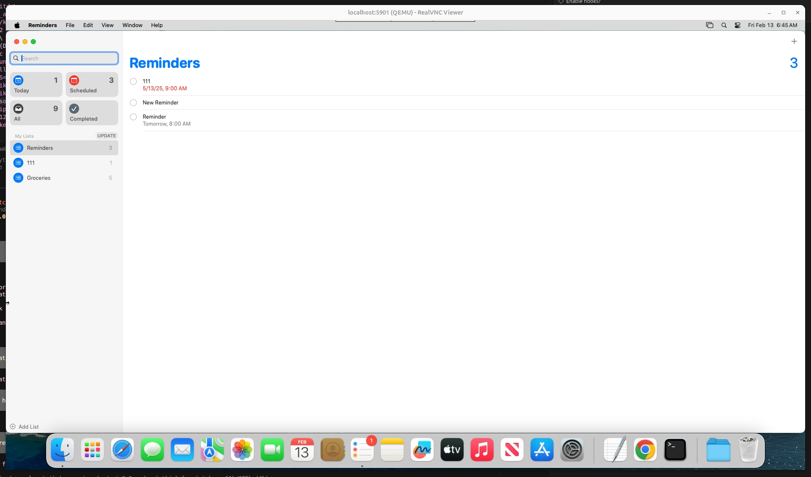

# Mac-in-Docker-OpenClaw

> **No Mac? No Problem!**
>
> 想体验 OpenClaw 的完整功能，却没有 Mac？本项目让你在 Windows / Linux 上通过 Docker 运行 macOS，零成本解锁 OpenClaw 的完整能力。
>
> 已有 Mac 但担心安全问题？也可以用 Docker 隔离运行，安心尝试。

## 目录

- [前置条件](#前置条件)
- [什么时候适合使用这个方案](#什么时候适合使用这个方案)
- [你将获得什么](#你将获得什么)
- [环境要求](#环境要求)
- [下载 macOS 镜像](#下载-macos-镜像)
- [启动 macOS Docker 容器](#启动-macos-docker-容器)
- [连接 macOS](#连接-macos)
- [OpenClaw App 指南](#openclaw-app-指南)
- [功能演示](#功能演示)

---

## 前置条件

- Docker 已安装
- Linux 或 Windows (WSL)

---

## 什么时候适合使用这个方案

- 你想在 Linux 或 Windows 上运行 macOS
- 你需要 macOS 专属能力（例如通过 BlueBubbles 使用 iMessage）
- 你希望使用容器化、可复现的 macOS 环境

## 你将获得什么

- 无需 Apple 硬件，在 Linux/Windows 运行 macOS
- 配置完成后可支持通过 BlueBubbles 使用 iMessage
- 便携、易重置的运行环境

## 环境要求

### Linux

- 支持虚拟化的现代 CPU（Intel VT-x 或 AMD-V）
- 已启用 KVM（可访问 `/dev/kvm`）
- 已安装 Docker
- 约 80 GB 可用磁盘空间
- 建议 8 GB 及以上内存

### Windows

- Windows 10/11 + WSL2
- Docker Desktop（WSL2 backend）
- 约 80 GB 可用磁盘空间
- 建议 8 GB 及以上内存

---

## 下载 macOS 镜像

从 Hugging Face 下载所需镜像文件（约 40GB）：

```bash
pip install huggingface_hub

huggingface-cli download fuyikun/Mac-in-docker-OpenClaw --local-dir .
```

或使用 Python：

```python
from huggingface_hub import snapshot_download

snapshot_download(repo_id="fuyikun/Mac-in-docker-OpenClaw", local_dir=".")
```

---

## 启动 macOS Docker 容器

**Linux 用户：**

```bash
# 启动容器
sudo docker run -itd \
    --name "macos_openclaw" \
    --device /dev/kvm \
    -p 52272:10022 \
    -p 5902:5902 \
    --add-host=host.docker.internal:host-gateway \
    -e "DISPLAY=${DISPLAY:-:0.0}" \
    -e EXTRA="-vnc 0.0.0.0:2,password=off" \
    -v /tmp/.X11-unix:/tmp/.X11-unix \
    -e CPU='Haswell-noTSX' \
    -e CPUID_FLAGS='kvm=on,vendor=GenuineIntel,+invtsc,vmware-cpuid-freq=on' \
    -v "/path/to/mac_hdd_ng.img:/home/arch/OSX-KVM/mac_hdd_ng_src.img" \
    -v "/path/to/BaseSystem.img:/home/arch/OSX-KVM/BaseSystem_src.img" \
    -e SHORTNAME=tahoe \
    -e USERNAME=test \
    -e PASSWORD='1234' \
    numbmelon/docker-osx-evalkit-auto:latest
```

**Windows (WSL2) 用户：**

在 WSL2 的 Linux 发行版中执行同一条命令。`/dev/kvm` 和 X11 socket 路径是 Linux 特有的，请确保 WSL2 中可用 KVM。

将 `/path/to/` 替换为你实际下载镜像文件的路径。

---

## 连接 macOS

### SSH 连接

```bash
ssh -p 52272 test@localhost
```

### VNC 连接（桌面）

```bash
vncviewer localhost:5902
```

输入 `1234` 作为密码进入桌面。



> **注意**：首次连接可能需要等待容器完全启动。

然后请下载 OpenClaw.img，并继续阅读 [OpenClaw App 指南](https://docs.openclaw.ai/start/onboarding) 完成 macOS app 配置。

---

## OpenClaw App 指南

先下载 OpenClaw macOS app，然后按照官方 onboarding 文档完成初始化和渠道配置：

- [OpenClaw App Guide](https://docs.openclaw.ai/start/onboarding)

---

## 功能演示



### 查看运行环境

```
Report the environment you are currently in
```



可以看到 OpenClaw 运行在 macOS 环境中。

### 发送 WhatsApp 消息

```
send a message to my whatsapp
```



### 设置提醒事项

```
Use Reminders to set a reminder for 8:00 AM tomorrow morning.
```



支持的提醒格式示例：

| 示例指令 | 说明 |
|----------|------|
| `Remind me to call mom at 3pm` | 下午 3 点提醒打电话 |
| `Set a reminder for tomorrow 9am to check emails` | 明天早上 9 点检查邮件 |
| `Create a reminder: meeting in 2 hours` | 2 小时后会议提醒 |

---

## Acknowledgements

感谢 [sickcodes/Docker-OSX](https://github.com/sickcodes/Docker-OSX) 和 [OpenGVLab/ScaleCUA](https://github.com/OpenGVLab/ScaleCUA)。

---

*文档更新时间: 2026-02-13*
